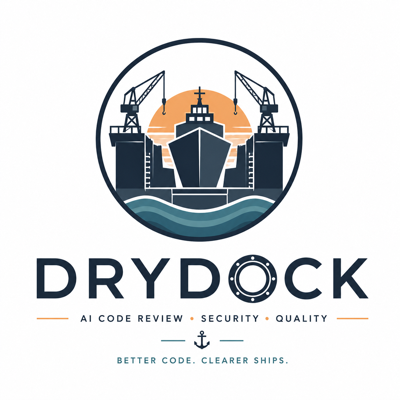

# Drydock



Automated code review for [NIP-34](https://github.com/nostr-protocol/nips/blob/master/34.md) Nostr repositories. Drydock listens for patch and pull request events on Nostr relays, reviews them with local LLMs, and publishes structured review comments back to the protocol.

## How It Works

```
Nostr Relays ──subscribe──▶ Listener ──▶ Ingest ──▶ Pipeline Workers
                                                        │
                                         ┌──────────────┼──────────────┐
                                         ▼              ▼              ▼
                                    Clone Repo    Build Context    LLM Review
                                                  (64K tokens)    (planner→reviewer)
                                                                       │
                                                                       ▼
Nostr Relays ◀──publish──────────────────────────────── Publisher (kind 1111)

IDE clients ──kind 30078 session + kind 25910 ContextVM──▶ IDE Gateway
Review marketplace ──kind 31990 profiles + kind 25910 assignments──▶ Reviewers
```

Drydock subscribes to NIP-34 event kinds (patches, PRs, repository announcements, status updates). When a new patch arrives, it clones the referenced repository, builds a deterministic context bundle within a 64K token budget, routes the patch through a planner→reviewer LLM pipeline, and publishes structured kind 1111 review comments. Kind 1617 patches are reviewed from the diff in the event content; kind 1618/1619 pull requests are reviewed from a real `git diff` of the PR tip against its merge-base with the default branch — computed in the canonical clone, never trusting a fork's view of history. Findings and walkthrough entries are validated against the deterministically parsed changed-file set before publication, and automatic reviews respect the root's NIP-34 status (open by default, drafts opt-in, merged/closed never). IDE and marketplace flows use ContextVM JSON-RPC over kind 25910 events for review requests, fix requests, assignments, accepts, and rejects. A meta-review loop evaluates review quality and feeds improvements back into the system.

All inference runs locally via OpenAI-compatible endpoints (Ollama, llama.cpp, vLLM). No code leaves your infrastructure.

## Nostr Protocol

Drydock is Nostr-native. See [Nostr Event Kinds](docs/event-kinds.md) for the current kind and tag map, including deprecated project-specific kinds, and [ContextVM Integration](docs/contextvm-integration.md) for kind 25910 JSON-RPC methods used by IDE and marketplace workflows.

## Quick Start

```bash
# Clone and build
git clone https://github.com/user/drydock.git && cd drydock
go build ./...

# Configure
cp .env.example .env
# Edit .env — set your signing identity and LLM endpoints

# Run
go run ./cmd/drydock
```

See [Deployment](docs/deployment.md) for Docker, multi-GPU, and production setups.

On startup, Drydock also maintains a kind 0 profile for its signing identity — publishing name, about text, and an icon/banner pushed to a Blossom media server — and refreshes it whenever the configured metadata changes. Repositories can tune review behavior (severity floor, reviewed statuses, custom instructions, auto-fix, ensemble mode) by committing a [`.drydock.yaml`](docs/repo-config.md).

## Prerequisites

| Requirement | Version | Notes |
|-------------|---------|-------|
| Go | 1.26+ | `CGO_ENABLED=0` — no C toolchain needed |
| Git | any | Used at runtime for clone, fetch, grep |
| Ollama (or compatible) | any | OpenAI-compatible `/chat/completions` endpoint |

## Configuration

All configuration is via `DRYDOCK_*` environment variables. See the full reference: **[docs/configuration.md](docs/configuration.md)**

Key settings:
- `DRYDOCK_SIGNER_BUNKER_URL` or `DRYDOCK_SIGNER_NSEC` — Nostr signing identity
- `DRYDOCK_RELAYS` — comma-separated relay URLs
- `DRYDOCK_PLANNER_BASE_URL`, `DRYDOCK_LLM70B_BASE_URL`, etc. — LLM endpoints

## Documentation

### Core

| Document | Description |
|----------|-------------|
| [Architecture](docs/architecture.md) | Component map, data flow, state machine, concurrency model |
| [Configuration](docs/configuration.md) | Complete environment variable reference |
| [Deployment](docs/deployment.md) | Native, Docker, signing, LLM setup, production hardening |
| [Nostr Protocol](docs/nostr-protocol.md) | Subscribed kinds, NIP-42 AUTH, comment structure, publishing rules |
| [Nostr Event Kinds](docs/event-kinds.md) | Current Nostr-native event kinds, tag conventions, deprecated kind replacements |
| [ContextVM Integration](docs/contextvm-integration.md) | Kind 25910 JSON-RPC methods for review, fix, and marketplace commands |
| [Review Engine](docs/review-engine.md) | Two-stage planner→reviewer pipeline, model routing, finding schema |
| [Per-Repository Configuration](docs/repo-config.md) | `.drydock.yaml` reference: severity floors, reviewed statuses, auto-fix, ensemble, custom instructions |
| [Context Builder](docs/context-builder.md) | 7-layer priority system, token budget, exclusion rules |
| [Meta-Review](docs/meta-review.md) | Self-improvement loop, gating logic, feedback routing |
| [Evaluation](docs/eval.md) | Held-out eval harness, metrics, dataset format |
| [Scaling](docs/scaling.md) | Bottlenecks, worker tuning, repo cache sizing, multi-instance |
| [Payments](docs/payments.md) | NWC and Cashu ecash integration for paid reviews |

### Platform Features

| Document | Description |
|----------|-------------|
| [Ensemble Review](docs/ensemble-review.md) | Multi-model parallel review with consensus scoring |
| [Codebase Chat](docs/codebase-chat.md) | Repository Q&A via Nostr encrypted DMs |
| [IDE Integration](docs/ide-integration.md) | Real-time diagnostics in VS Code and Neovim |
| [Marketplace](docs/marketplace.md) | Community reviewer registry with reputation system |

## Project Structure

```
cmd/
  drydock/          # Main service binary
  drydock-eval/     # Evaluation harness binary
  lsp-bridge/       # Multi-language LSP server manager
internal/
  config/           # Environment variable parsing
  listener/         # Nostr relay subscription and event dispatch
  ingest/           # Event verification, dedup, and review queue
  pipeline/         # Worker pool orchestrating the review lifecycle
  contextbuilder/   # Deterministic context assembly (7 layers, 64K budget)
  reviewengine/     # Planner→reviewer LLM pipeline with retry and ensemble
  publisher/        # Kind 1111 comment construction and relay fanout
  metareview/       # Self-improvement loop with few-shot management
  promptrefine/     # Automated prompt versioning with eval-gated rollback
  repo/             # Git repo cloning, patching, and LRU cache
  signing/          # NIP-46 bunker and local nsec signers
  db/               # SQLite storage, schema, and queries
  health/           # /healthz and /readyz HTTP endpoints
  eval/             # Evaluation harness and metrics
  codechat/         # Codebase Q&A via Nostr encrypted DMs
  idegateway/       # IDE integration protocol handler
  marketplace/      # Community reviewer registry and routing
  conversation/     # Multi-turn review thread handler
  securityscan/     # Deterministic SAST scanner
  payment/          # NWC and Cashu payment integration
extensions/
  vscode-drydock/   # VS Code extension for IDE integration
eval/
  heldout-sample.json  # Labeled evaluation dataset
```

## Development

```bash
make build    # go build ./...
make test     # go test ./...
```

This project uses [beads](https://github.com/beads-project/beads) for issue tracking. Run `bd ready` to find available work.

## License

MIT
